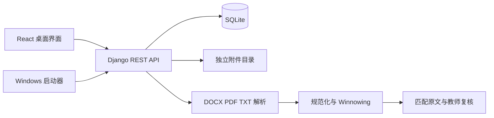
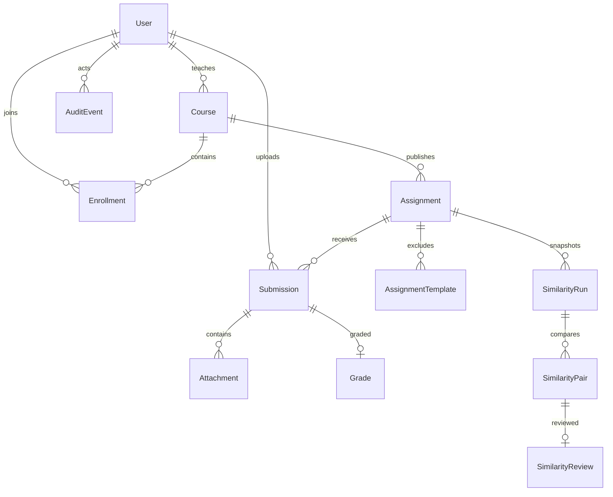

# 系统设计与代码阅读

本项目面向单机教学演示，采用本机浏览器界面、Django REST 接口、SQLite 和独立附件目录。运行时只监听 127.0.0.1。前端不保存真实业务数据库，不调用大语言模型，不执行学生上传的程序。

## 七项需求与入口

| 指导书功能 | 实现入口 | 主要约束 |
| --- | --- | --- |
| 实验课程管理 | classroom；管理员课程页面 | 教师归属、选课关系、归档后停止写入 |
| 用户管理 | accounts；用户管理页面 | 账号新增、编辑、停用、密码重置 |
| 角色和权限 | common/permissions.py；Session | 三角色、课程范围、学生只见自己提交 |
| 作业上交 | assignments/submissions.py；提交对话框 | 必交类别、期限、限额、版本和请求幂等 |
| 作业批改 | assignments/grading.py；批改页面 | 只改最新版本；重交不继承旧分数 |
| 成绩统计与发布 | statistics.py；成绩页面 | 发布前学生不可见；均分排除未交与未批改 |
| 防作弊 | plagiarism；检测与复核页面 | 最新版本、同类同语言、模板排除、人工复核 |

## 数据关系

业务实体共 12 个，另有 Django 的会话、权限、迁移等内置表。

Submission 的 assignment/student/version 组合唯一，student/request_id 组合唯一。Grade 绑定一次具体提交；最高分由服务层核对 Assignment.total_score。课程和历史提交受保护，账号角色变更不得破坏教师或选课关系。公共模板修订号与提交 ID 列表共同决定检测快照是否过期。

## 关键流程

提交先检查角色、课程、文件类别、大小与名称，再计算请求内容指纹。在 SQLite IMMEDIATE 事务内重读当前作业、检查请求重试与截止规则、分配新版本。磁盘写入或事务失败时清理本次附件；同一请求重试返回同一版本，改变内容复用请求编号返回 409。

教师批改最新版本，保存或修改成绩将撤回发布状态。发布是明确的独立操作；学生序列化结果在未发布时不包含成绩和评语。均分只使用最新且已批改版本，未交和未批改不按零分处理。CSV 包含 UTF-8 BOM，并对姓名、学号、评语中的公式前缀转义。

检测取不同学生最新提交。同类报告互比，同语言代码互比。报告用 NFKC 和空白规范化；代码用 Pygments 词元并过滤注释及空白。报告参数 k=20、w=10；代码 k=12、w=8。每个完整窗口选最右最小 SHA-256 指纹，比较时同时核对单位序列。双方覆盖率按去重有效指纹集合分别计算。保存原文范围、段落/页码/行号与复核备注，复核不改变成绩。

## 接口与错误

Session Cookie 与 CSRF 配合；登录后 CSRF 会旋转，前端重新读取 token。列表接口通常分页，前端 listAll 用于界面需要完整集合的场景。错误含 code、message、fields，权限不足为 403 或范围隐藏的 404，冲突 409，文件超限 413。

| 路径 | 主要方法 |
| --- | --- |
| /api/auth/csrf/、login/、me/、logout/ | GET/POST |
| /api/users/、/api/courses/ | GET/POST/PATCH |
| /api/courses/{id}/enrollments/ | GET/POST |
| /api/courses/{id}/enrollments/{enrollment_id}/ | DELETE |
| /api/assignments/{id}/submissions/ | GET/POST multipart |
| /api/attachments/{id}/download/、content/ | GET |
| /api/submissions/{id}/grade/ | PUT |
| /api/assignments/{id}/statistics/、grades/ | GET |
| /api/assignments/{id}/grades/publish/、unpublish/ | POST |
| /api/assignments/{id}/grades/export/ | GET CSV |
| /api/assignments/{id}/templates/、similarity-runs/ | GET/POST |
| /api/similarity-pairs/{id}/、review/ | GET/PUT |

接口的具体字段以 serializers.py、views.py 和 frontend/src/lib/contracts.ts 为准。前端菜单只改善操作体验，权限判断在服务端执行。

## 界面与运行边界

桌面布局以作业列表为中心，动画标签改编自 21st.dev 收录的 Motion Primitives 真实源码；对话框改编自 shadcn/ui 并使用 Radix 的焦点与键盘行为。玻璃效果通过半透明、模糊、边框高光与层叠阴影实现，不声称模拟真实光学折射。

第一版不含 OCR、变量重命名归一、语义检测、跨语言比较和外部学术数据库。相似度是复核线索。同步检测有附件和字符限额，大规模教学使用仍需任务队列、负载测试与真实语料评价。
